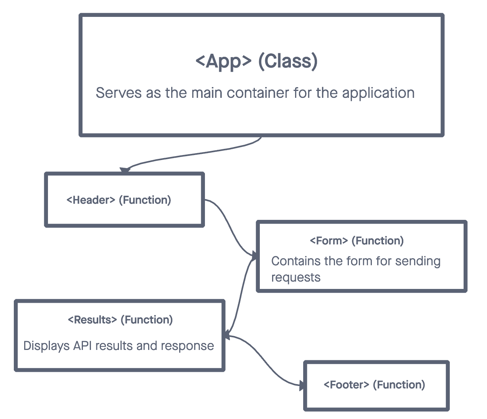

# resty

## Usage

RESTy is a user-friendly application for testing and interacting with RESTful APIs.

## Getting Started

### UML



### Installation

- Install dependencies

    ```bash
        git clone https://github.com/sfpagalan/resty.git
        cd resty
    `npm install uuid sass`
    `npm install`

- Start server
    `npm run dev`

## License

This project is licensed under the [License Name] License - see the [LICENSE.md](LICENSE.md) file for details.